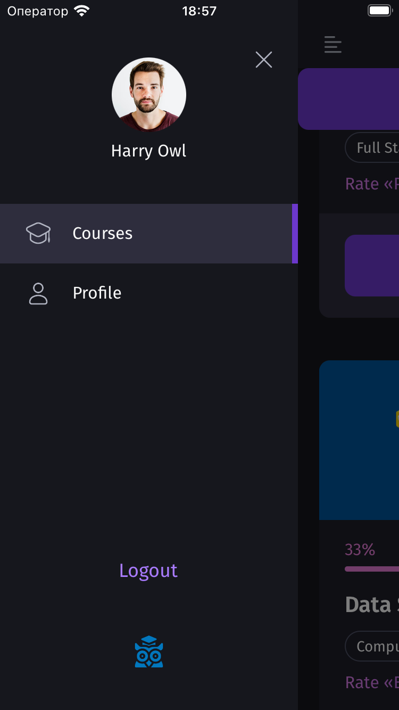

# owlunion_mobile

## Introduction

This repository contains demonstration-only code for the "owlunion_mobile" project. It is important to note that this codebase is not complete and is intended for demonstration purposes only. The code will not run as-is and is provided to showcase potential functionalities using React Native.

## About the Project

The "owlunion_mobile" project is a mobile application aimed at facilitating the viewing of educational courses. The app is designed to help users browse and interact with a variety of educational content conveniently on their mobile devices.

## Key Technologies

- **React Native**: A framework for building native apps using React.
- **TypeScript**: Adds static typing abilities to JavaScript to improve development and maintainability.
- **Expo**: An open-source platform used for building and serving the application, simplifying the setup and testing processes.
- **Axios**: Used for performing network requests to fetch course data and other resources.
- **React Navigation**: Manages the navigation experience within the app, from simple stack navigators to complex drawer navigations.

## Screenshots

Here are some visual examples of what the app offers, showing key screens and functionalities:

*Figure 1: Example of the login screen, where users begin their journey.*

*Figure 2: Example of the navigation menu, allowing users to easily move between different sections of the app.*

*Figure 3: Example of the course list screen, where users can browse and select courses.*

## Disclaimer

Please remember that this code is intended for demonstration purposes only and is not complete. It serves as an example of how a mobile educational platform could be implemented using modern technologies such as React Native and TypeScript.